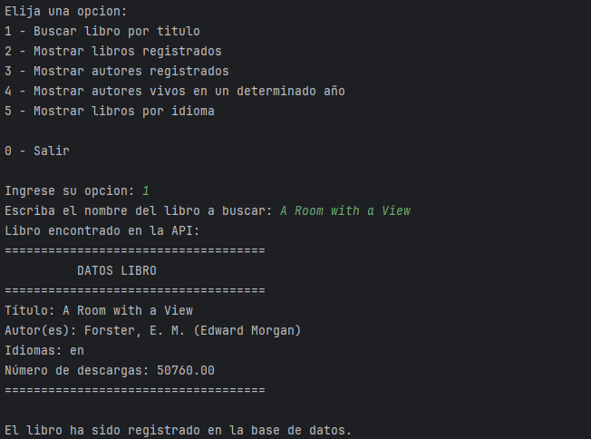
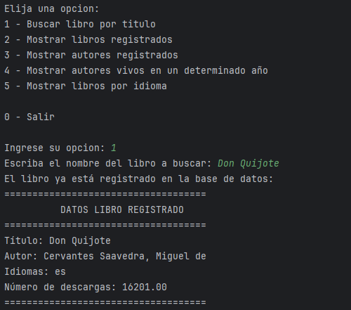
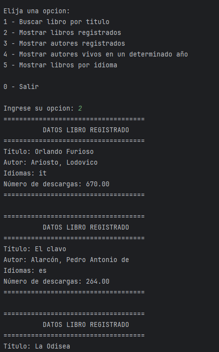
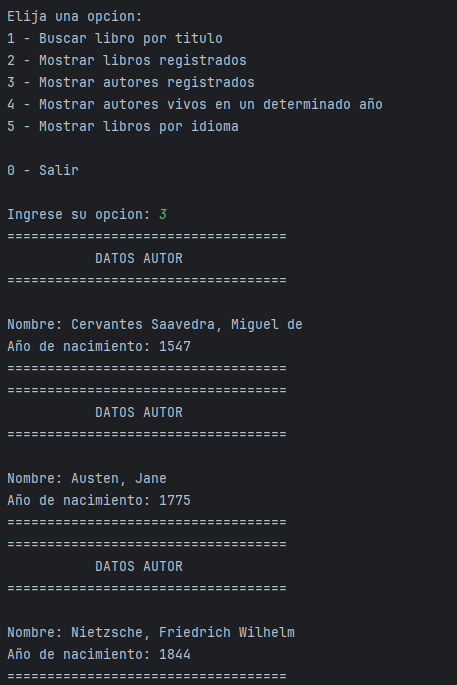
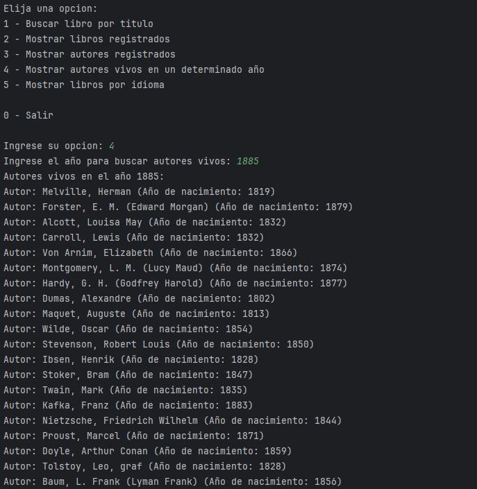
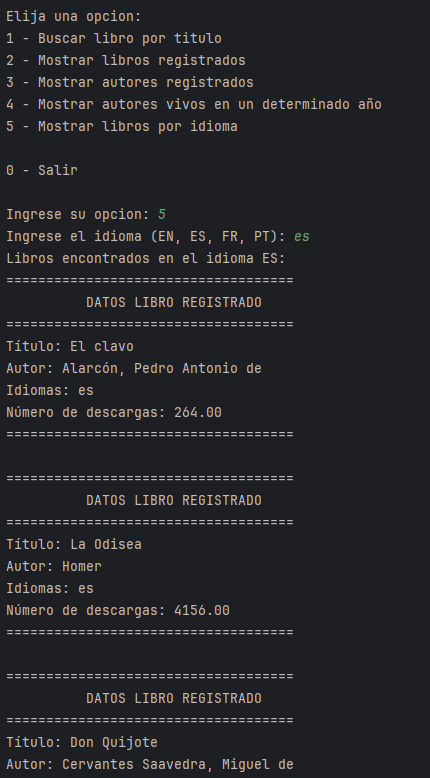

# Literalura - Catálogo de Libros

## 📖 Descripción del Proyecto
Literalura es una aplicación de consola que permite a los usuarios explorar y gestionar un catálogo de libros. Utiliza la API Gutendex para obtener datos de libros, incluyendo autores, idiomas y descargas, y los almacena en una base de datos PostgreSQL. Este proyecto es parte del programa de formación ofrecido por Alura Latam.

## 💻 Funcionalidades
- Buscar libros por título en la API de Gutendex.
- Registrar libros en una base de datos evitando duplicados.
- Listar libros registrados en la base de datos.
- Mostrar autores vivos en un año específico.
- Filtrar libros por idioma.

## 🛠 Tecnologías Utilizadas
- **Java 17**: Lenguaje de programación.
- **Spring Boot**: Framework para la creación de aplicaciones web y acceso a datos.
- **PostgreSQL**: Sistema de gestión de bases de datos.
- **Gutendex API**: Fuente de datos para los libros.
- **IntelliJ IDEA**: Entorno de desarrollo integrado.
- **Git y GitHub**: Control de versiones y repositorio remoto.
- **Trello**: Herramienta de organización y seguimiento de tareas.
